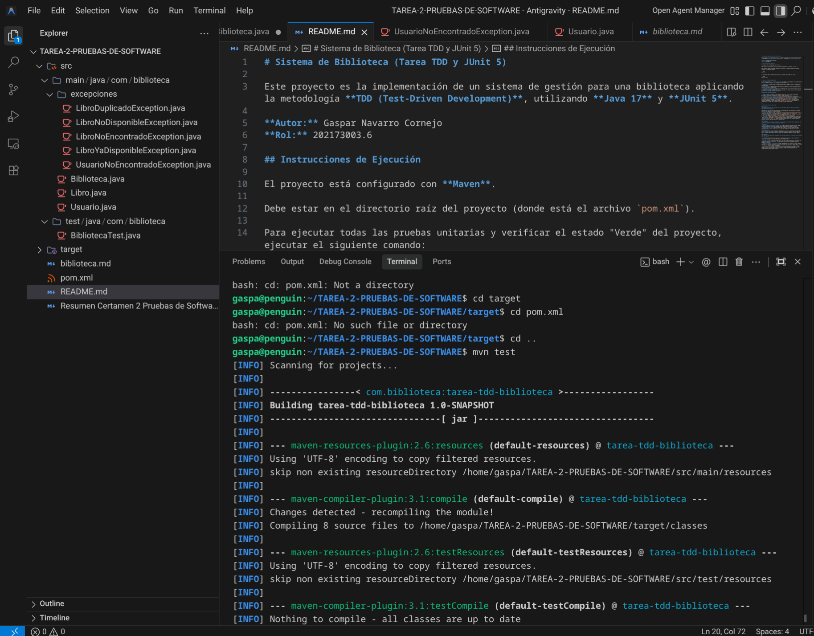
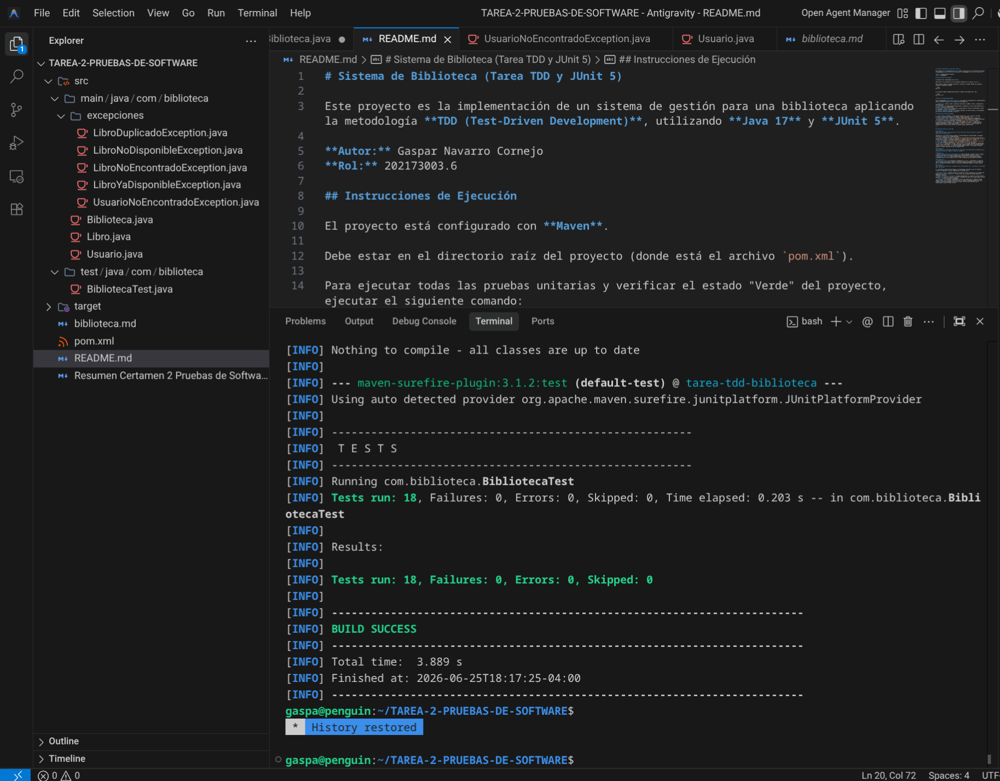

# Sistema de Biblioteca (Tarea TDD y JUnit 5)

Este proyecto es la implementación de un sistema de gestión para una biblioteca aplicando la metodología **TDD (Test-Driven Development)**, utilizando **Java 17** y **JUnit 5**.

**Autor:** Gaspar Navarro Cornejo  
**Rol:** 202173003.6

## Instrucciones de Ejecución

El proyecto está configurado con **Maven**. 

Debe estar en el directorio raíz del proyecto (donde está el archivo `pom.xml`).

Para ejecutar todas las pruebas unitarias y verificar el estado "Verde" del proyecto, ejecutar el siguiente comando:

```bash
mvn test
```

Si se quiere limpiar compilaciones previas y ejecutar todo desde cero, usar:

```bash
mvn clean test
```

## Casos de Prueba Implementados

Se implementó **18 pruebas unitarias** que cubren la totalidad de los requerimientos base y el desafío opcional. Las pruebas están divididas en:

1. **Registro:** Libros válidos, validación nulos/vacíos (ISBN y Título), validación de ISBN duplicado.
2. **Búsqueda:** Por ISBN existente/inexistente, búsqueda por Título (case-insensitive y parcial), listado de disponibles.
3. **Préstamo y Devolución:** Flujo feliz, excepciones por libros no encontrados, libros ya prestados y libros ya disponibles.
4. **Desafío Opcional (Usuarios):** Préstamo asociado a un ID de usuario y la validación estricta de límite de préstamos (máximo 3).

## Decisiones de Diseño Adoptadas

1. **Uso de Mapas (`HashMap`):** Se utilizó `Map<String, Libro>` para el catálogo principal, permitiendo búsquedas por ISBN.
2. **Excepciones Personalizadas:** Se crearon excepciones específicas heredando de `RuntimeException` (ej. `LibroNoDisponibleException`) para no forzar el manejo de excepciones chequeadas (`try-catch`) en todo el flujo.
3. **Separación de Responsabilidades:** Los métodos de búsqueda por título o listado retornan *copias* inmutables o listas nuevas usando `Streams` (`.toList()`) para proteger la encapsulación y evitar que se altere el estado original desde afuera.

---

## Reflexión sobre el uso de TDD

### Pregunta 1
**Describe brevemente cómo aplicaste el ciclo TDD (Red → Green → Refactor) durante el desarrollo del ejercicio.**

Para el ciclo TDD, la verdad lo fui aplicando súper iterativo, funcionalidad por funcionalidad. Un ejemplo claro fue con el tema del ISBN duplicado:
1. **Red:** Primero armé el test `testRegistrarLibro_ConIsbnDuplicado_DebeLanzarExcepcion`, registré un libro e intenté meter otro con el mismo ISBN. Obvio falló porque el sistema estaba incompleto y simplemente sobrescribía el dato en el `HashMap`.
2. **Green:** Fui a `Biblioteca.java` y le puse un `if (catalogo.containsKey(isbn))` súper simple que lanzaba la `LibroDuplicadoException`. Corrí la prueba y pasó a verde.
3. **Refactor:** Como vi que el método `registrarLibro` me estaba quedando gigante con tanta validación de nulos y vacíos, tiré toda esa lógica a un método privado `validarLibro(Libro libro)`. El código quedó mucho más limpio y como los tests seguían pasando, me quedé tranquilo de que no había roto nada.

### Pregunta 2
**¿Qué ventajas y desventajas observaste al desarrollar utilizando TDD en comparación con implementar primero el código y luego las pruebas?**

**Lo bueno (Ventajas):**
- Te obliga a hacer el código justo y necesario (YAGNI), sin sobrepensar ni hacer sobre-ingeniería de más.
- Depurar es casi automático. Como iba metiendo código de a poco, si un test fallaba, notaba inmediatamente la falla que estaba en las tres líneas que acababa de escribir.

**Lo malo (Desventajas):**
- La configuración inicial. Configurar el `pom.xml`, armar la estructura de las pruebas y pensar la lógica "al revés" (desde el test) hace que uno parta súper lento comparado con simplemente ponerse a escribir código a lo loco.

### Pregunta 3
**Si tuvieras que desarrollar nuevamente este sistema desde cero, ¿continuarías utilizando TDD? ¿Por qué?**

Sí, de todas maneras, sobre todo aplicando las buenas prácticas de SQA que uno va agarrando en los proyectos. El problema es del principio de aprender luego se ve como una inversión de tiempo necesaria y valiosa cuando el sistema empieza a crecer y funciona correctamente.

Primero, pensar en las pruebas antes te obliga a ponerte en el lugar del que va a usar tus clases, entonces la arquitectura te queda mucho más cohesiva. También, cuando hice la parte del límite de los 3 libros (el opcional), analizar los valores límite en el test me salvó de un típico bug de poner `>` en vez de `>=` antes de mandar todo a producción. 
Por último, te da confianza para refactorizar. Normalmente uno le tiene terror a tocar código que ya funciona, pero al cambiar las búsquedas manuales por Streams de Java, la red de seguridad de los tests me avisaba al segundo si estaba rompiendo algo o no.

---

## Evidencia de Ejecución

A continuación se muestra la evidencia de la ejecución exitosa de los 18 casos de prueba (estado Verde del TDD):



